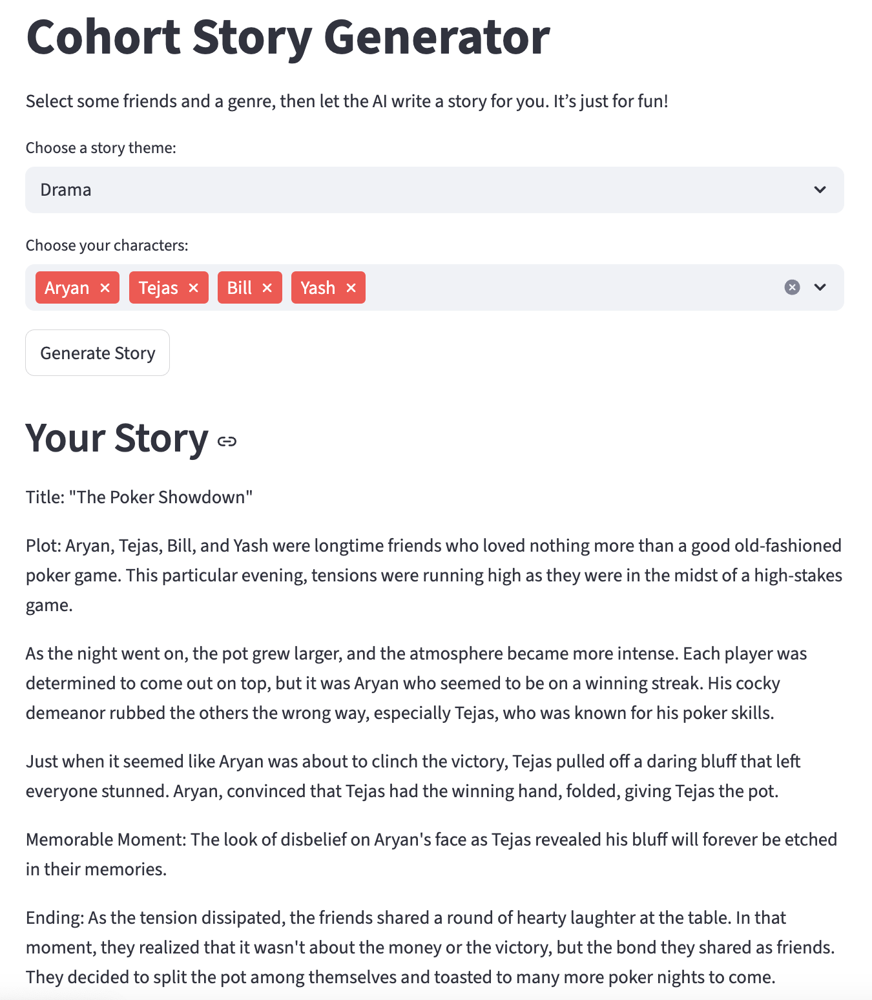

# Cohort Drama Simulator

This app uses GPT-3.5 to write short fictional stories using names from our AIPI cohort. You pick a genre and a few classmates, and it generates something creative with them as the characters. It was a fun way to experiment with large language models while building something simple and interactive.

The app is built with Streamlit and calls the OpenAI API. I used a JSON file to hold all the names and a custom prompt template guides the structure of the story.

## How to Run

```
git clone https://github.com/dayeon3117/cohort-drama-simulator.git
cd cohort-drama-simulator
pip install -r requirements.txt

# then create a .env file and add this line with your OpenAI key:
OPENAI_API_KEY=your_api_key_here

streamlit run app.py
```

Once it opens in your browser, just pick some names, choose a story type and click the button to generate the story.

## Testing

I added a quick test to check if the generated prompt includes both the genre and the selected names. It’s not comprehensive, but it confirms that the core prompt logic is working.

To run the test:

```
pytest test_prompt.py
```

## Tech Notes

- Built with Streamlit and OpenAI’s GPT-3.5 API
- Uses a custom prompt template to build genre specific story prompts
- Loads names dynamically from a JSON file
- Basic unit testing in `test_prompt.py`
- CI/CD enabled via GitHub Actions (`.github/workflows/test.yml`)
- Error handling included for API issues and UI input checks
- Deployed on Streamlit Cloud


## Notes

I wanted to make sure the code was easy to read and organized. I added some error handling in case the API doesn't respond properly, and I tried to write the prompt in a way that allows for variety in the outputs without making things too unpredictable. It’s deployed on Streamlit Cloud, but the structure is modular enough that it could also be extended further. I just wanted to build something that feels personal while staying technically clean.

## Live Demo

[Try the app here](https://cohort-story-generator-jmouokusuji2mmayrha3pq.streamlit.app/)



## Author

Dayeon Kang  
Duke University  
AIPI 561: Operationalizing AI  
